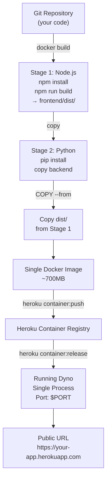

# 🎬 Movie Recs - Full Heroku Docker Deployment Guide

> **Everything is ready!** All code changes are complete. Just follow the 6 deployment steps below.

---

## 📋 What Was Changed

To enable Heroku Docker deployment with a single container (frontend + backend), the following files were created/modified:

### New Files ✨
| File | Purpose |
|------|---------|
| `Dockerfile` | Multi-stage build: Node → Python with embedded frontend |
| `.dockerignore` | Exclude dev files from Docker context |
| `.env.example` | Root-level env template for Heroku |
| `HEROKU_DEPLOYMENT.md` | This deployment guide |

### Modified Files 🔧
| File | Change |
|------|--------|
| `backend/app/main.py` | Added StaticFiles mounting + flexible CORS |
| `backend/start_production.py` | Dynamic `$PORT` from environment |
| `backend/app/config/settings.py` | FRONTEND_URL now optional |
| `frontend/src/config.js` | Same-origin support (empty VITE_API_BASE_URL) |
| `frontend/.env.example` | Documentation for env variables |
| `DEPLOYMENT_GUIDE.md` | Added Heroku Docker section |

---

## 🚀 Quick Deploy (6 Steps)

### 1️⃣ Login to Heroku
```bash
heroku login
```
Opens browser to authenticate. Close when done.

### 2️⃣ Create App & Set Stack
```bash
heroku create YOUR-APP-NAME
heroku stack:set container
```
Replace `YOUR-APP-NAME` with your chosen app name (e.g., `movie-recs-app`).

### 3️⃣ Configure API Keys
```bash
heroku config:set \
  TMDB_API_KEY=your_tmdb_key \
  GEMINI_API_KEY=your_gemini_key \
  LANGSEARCH_API_KEY=your_langsearch_key \
  SECRET_KEY=$(python -c "import secrets; print(secrets.token_urlsafe(32))")
```

**Get your API keys:**
- **TMDB**: https://www.themoviedb.org/settings/api
- **Gemini**: https://makersuite.google.com/app/apikey
- **LangSearch**: Your provider's dashboard

### 4️⃣ Login to Docker Registry
```bash
heroku container:login
```

### 5️⃣ Build & Push Image
```bash
heroku container:push web
```
⏳ Takes 2-3 minutes. Grabs dependencies, builds frontend, builds final image.

### 6️⃣ Release & Open
```bash
heroku container:release web
heroku open
```

**That's it!** Your app is live at `https://your-app-name.herokuapp.com/` ✨

---

## ✅ Verify It Works

After deployment:

```bash
# 1. Check if app loaded (opens in browser)
heroku open

# 2. Test health check
curl https://your-app-name.herokuapp.com/ping
# Should return: {"message":"pong"}

# 3. View logs for any errors
heroku logs --tail

# 4. Check dyno status
heroku ps
```

If you see the React app load, and health check returns pong, you're good! 🎉

---

## 🏗️ Architecture

### What Happens When You Deploy



### Inside the Running Dyno

```
Gunicorn (Process Manager)
└── Uvicorn (ASGI Server)
    ├── FastAPI Application
    │   ├── Backend Routes
    │   │   ├── GET /ping
    │   │   ├── GET /search
    │   │   ├── POST /recommendations
    │   │   └── POST /profile/*
    │   └── Static File Serving
    │       ├── GET / → index.html (React)
    │       ├── GET /assets/* → CSS/JS bundles
    │       └── GET /* → index.html (SPA fallback for React Router)
    │
    └── Listens on $PORT (Heroku dynamic port)
```

---

## 🔐 Security & Environment

### Why We Don't Set Certain Env Vars

On Heroku, these are **intentionally unset**:

| Variable | Why | What Happens |
|----------|-----|--------------|
| `API_BASE_URL` | Not needed; API on same domain | Backend ignores, uses fallback |
| `FRONTEND_URL` | Not needed; frontend served from same domain | CORS allows all origins (safe) |
| `VITE_API_BASE_URL` | Not in Heroku config | Defaults to empty string |

When these are unset:
- Frontend makes requests like `GET /search` (relative path)
- Backend serves frontend from `/` and API from `/search`
- Same domain = no CORS issues ✅

### Secrets Management

```bash
# ✅ Correct (production)
heroku config:set TMDB_API_KEY=xxx

# ❌ Wrong (insecure)
# Don't commit to .env file
# Don't hardcode in code
```

**Never commit `.env` files** — only `.env.example` as template.

---

## 📦 File Structure After Deployment

Inside the running Docker container:

```
/app/
├── app/                      # Backend Python code
│   ├── main.py             # FastAPI app (serves API + mounts static files)
│   ├── config/
│   ├── core/
│   ├── models/
│   ├── services/
│   └── utils/
├── frontend/
│   └── dist/               # Built React files (mounted as static)
│       ├── index.html
│       └── assets/
│           ├── *.js
│           └── *.css
└── requirements.txt        # Python dependencies
```

When you visit `https://your-app.herokuapp.com/`:
1. Server returns `frontend/dist/index.html`
2. Browser loads React app
3. React app makes API calls to `/search`, `/recommendations`, etc.
4. FastAPI handles those routes
5. All on same domain ✅

---

## 🔄 Update Your App

After making code changes:

```bash
git add .
git commit -m "Your changes"

heroku container:push web
heroku container:release web

# Done! Changes live in ~1-2 minutes
```

Or use shorthand:
```bash
git push && heroku container:push web && heroku container:release web
```

---

## 📊 Resource Usage

### Dyno Specs
- **Type**: Free or Hobby (default)
- **Memory**: 512 MB
- **CPUs**: Shared
- **Ephemeral Filesystem**: 512 MB (resets on restart)

### App Usage Estimate
- Python runtime: ~150 MB
- Dependencies: ~100 MB
- Frontend assets: ~200 KB
- **Total**: ~250 MB (comfortable in 512 MB dyno)

If you exceed limits, upgrade to Standard or Professional dyno.

---

## 🆘 Troubleshooting

### App crashes on startup
```bash
heroku logs --tail -a your-app-name
```
Look for:
- Missing API keys → Add with `heroku config:set`
- Python errors → Check backend code
- Docker build failed → Check Dockerfile syntax

### Frontend loads but API calls fail
```bash
# Check CORS error in browser console
# Check if frontend making requests to /api or /search
curl https://your-app.herokuapp.com/ping
# If this works, API is running. Issue is likely frontend request URL.
```

### Dyno keeps restarting
- Check logs for crashes
- Check if app is binding to correct PORT: `port = os.getenv("PORT", "8000")`
- Verify `start_production.py` is running correctly

### Port binding error
```bash
# Verify start_production.py uses PORT env var
# Check: port = os.getenv("PORT", "8000")
```

### Docker image too large / slow to boot
```bash
# Remove unused dependencies from requirements.txt
# Remove unused node packages from package.json
# Check Dockerfile has only necessary COPY commands
```

---

## 📈 Scaling & Advanced

### Scale to Multiple Dynos
```bash
heroku ps:scale web=2
# Now 2 dynos running, load balanced
```

### Monitor Performance
```bash
heroku metrics
```

### View Recent Deployments
```bash
heroku releases
```

### Rollback to Previous Version
```bash
heroku rollback
```

### Add Database (Optional)
```bash
heroku addons:create heroku-postgresql:hobby-dev
# Creates PostgreSQL, sets DATABASE_URL automatically
```

---

## ✨ Features Enabled by This Setup

✅ **Frontend & Backend in Single Container**
- Simpler deployment
- Single dyno = lower cost
- Frontend served from same domain

✅ **Multi-Stage Docker Build**
- Optimized image size
- No build tools in production
- Only dependencies needed at runtime

✅ **Automatic Port Binding**
- Respects Heroku's `$PORT` env var
- Works on any port without changes

✅ **Same-Origin Requests**
- No CORS issues between frontend and API
- Both on same domain

✅ **Environment-Based Configuration**
- Secrets in Heroku config (not in code)
- Different configs for dev/production

---

## 🎯 Next Steps (Optional)

1. **Add Custom Domain** (requires paid Heroku account)
   ```bash
   heroku domains:add your-domain.com
   ```

2. **Enable HTTPS** (automatic with *.herokuapp.com, required for custom domain)

3. **Add Database** for persistent data
   ```bash
   heroku addons:create heroku-postgresql
   ```

4. **Set Up CI/CD** (auto-deploy on git push)
   - Connect GitHub repo to Heroku app
   - Configure auto-deploy on push to main

5. **Add Monitoring** for performance tracking
   - Heroku Metrics (built-in)
   - New Relic (add-on)

6. **Configure Workers** for background jobs
   - Create background tasks for long-running processes

---

## 📞 Need Help?

### Common Issues & Fixes

**"App crashes immediately"**
```bash
heroku logs --tail
# Shows exact error. Usually missing API key.
heroku config:set MISSING_KEY=value
```

**"Frontend loads but no API responses"**
- Check browser console for CORS errors
- Verify API keys are set: `heroku config`
- Test health check: `curl https://your-app.herokuapp.com/ping`

**"Takes too long to boot"**
- Docker image might be too large
- Check if dependencies can be pruned
- Consider splitting frontend/backend (advanced)

**"Out of memory"**
- Scale up dyno: `heroku ps:type standard-1x`
- Optimize app (cache, database pooling)
- Monitor with: `heroku metrics`

### Resources
- [Heroku Dev Center](https://devcenter.heroku.com/)
- [Heroku Container deploy docs](https://devcenter.heroku.com/articles/container-registry-and-runtime)
- [Troubleshooting Heroku apps](https://devcenter.heroku.com/articles/troubleshooting-common-problems)

---

## 🎉 Success!

Once deployed and verified:

```bash
✅ Frontend loads at https://your-app.herokuapp.com/
✅ API responds to /ping
✅ Movie search works
✅ Profile creation works
✅ Logs show no errors
```

**Congratulations!** Your movie recommendations app is live! 🚀🎬

---

## 📝 Deployment Checklist

```
Setup:
  ☐ Install Heroku CLI
  ☐ Install Docker
  ☐ Get API keys ready (TMDB, Gemini, LangSearch)

Deployment (6 steps):
  ☐ heroku login
  ☐ heroku create + heroku stack:set container
  ☐ heroku config:set (API keys + SECRET_KEY)
  ☐ heroku container:login
  ☐ heroku container:push web
  ☐ heroku container:release web

Verification:
  ☐ heroku open (frontend loads)
  ☐ curl /ping (API responds)
  ☐ Search for movie (TMDB works)
  ☐ Create profile (backend works)
  ☐ heroku logs shows no errors
```

---

**Ready?** Start with Step 1 above. You've got this! 🚀
